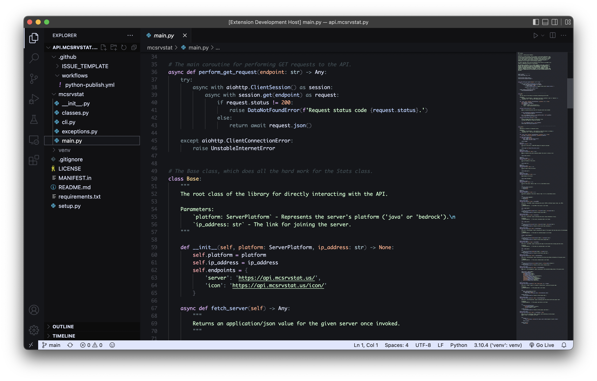

# Blast Dark
### An aesthetic Visual Studio Code theme, completely developed outta randomness.


<br>


<p align='center'>Project in the image: <a href='https://github.com/hitblast/api.mcsrvstat.py'>api.mcsrvstat.py</a></p>

<br><br>

## Overview

Blast Dark is an eye-candy Visual Studio Code (VSCode) theme which is especially made with long coding hours in mind. It features a custom color palette which combines both the lukewarm and the industrial feel into one, single theme. It's one of those projects which I had a lot of fun developing, just because it gives me a fair bit of chills.

<br>

## Installation

1. Through the Command Line:
    - Make sure you have Visual Studio Code in your PATH.
    - Open a terminal window and paste in the following command:
        ```bash
        code --install-extension HitBlast.blast-dark
        ```

2. Through the Extensions pane:
    - Open a Visual Studio Code instance.
    - [Navigate to this link](https://marketplace.visualstudio.com/items?itemName=HitBlast.blast-dark) and click on **Install**.

<br>

## License

```
MIT License

Copyright (c) 2022 HitBlast

Permission is hereby granted, free of charge, to any person obtaining a copy
of this software and associated documentation files (the "Software"), to deal
in the Software without restriction, including without limitation the rights
to use, copy, modify, merge, publish, distribute, sublicense, and/or sell
copies of the Software, and to permit persons to whom the Software is
furnished to do so, subject to the following conditions:

The above copyright notice and this permission notice shall be included in all
copies or substantial portions of the Software.

THE SOFTWARE IS PROVIDED "AS IS", WITHOUT WARRANTY OF ANY KIND, EXPRESS OR
IMPLIED, INCLUDING BUT NOT LIMITED TO THE WARRANTIES OF MERCHANTABILITY,
FITNESS FOR A PARTICULAR PURPOSE AND NONINFRINGEMENT. IN NO EVENT SHALL THE
AUTHORS OR COPYRIGHT HOLDERS BE LIABLE FOR ANY CLAIM, DAMAGES OR OTHER
LIABILITY, WHETHER IN AN ACTION OF CONTRACT, TORT OR OTHERWISE, ARISING FROM,
OUT OF OR IN CONNECTION WITH THE SOFTWARE OR THE USE OR OTHER DEALINGS IN THE
SOFTWARE.
```

Original license document can be found [here.](https://github.com/hitblast/blast-dark/blob/master/LICENSE)